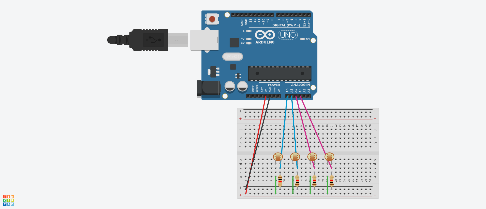

# Reactive Systems - Final Project
Assignment for INF1350 - Reactive Systems in Pontifical Catholic University of Rio de Janeiro (PUC-Rio)

## Group members
[André Mazal Krauss](https://github.com/amk1710)

[Pedro Sousa Meireles](https://github.com/psmeireles)

## Assignment
We develop a simple game. The objective is to prevent a bubble from touching the edges of the window.

The player uses movement control to move the bubble. The movement control is implemented using photoresistors and an Arduino Uno.

The circuit schematic is available in the following picture:

## Demo

